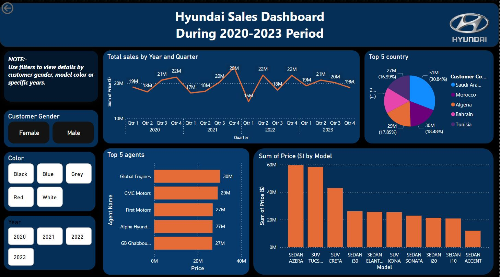

# 🚗 Hyundai Sales Dashboard (2020-2023) 📊

Welcome to the **Hyundai Sales Dashboard**, an interactive Power BI report that provides valuable insights into Hyundai's sales performance over the years **2020 to 2023**. This dashboard enables users to explore sales trends, analyze customer preferences, and identify key business opportunities. 🚀

---

## 🔍 Overview
This **Power BI Dashboard** showcases:
✔ **Sales trends** over different quarters and years 📈
✔ **Top-selling models** and revenue distribution 💰
✔ **Best-performing agents** based on sales figures 🏆
✔ **Customer insights** based on gender, location, and preferences 🌍
✔ **Interactive filters** for enhanced analysis 🎛️

---

## 📂 Data Collection & Processing
### 🔧 Steps Taken:
1. **📥 Data Collection**: Extracted sales data from an online source.
2. **🛠 Data Cleaning & Preparation**:
   - Removed unnecessary columns 📌
   - Used **VLOOKUP & Excel functions** to merge and enhance data 🏗️
   - Added calculated fields for deeper analysis 📊
3. **📤 Data Import into Power BI**:
   - Loaded the cleaned dataset into **Power BI**
   - Established relationships between different datasets 🔗

---

## 🎨 Power BI Dashboard Features
### 🖥️ Visualizations & Insights
✅ **📅 Sales Trend (Line Chart)** - Track sales changes over time
✅ **🌍 Top 5 Countries (Pie Chart)** - Breakdown of sales by geography
✅ **🤝 Top 5 Agents (Bar Chart)** - Identify top-performing sales agents
✅ **🚗 Model-wise Sales (Bar Chart)** - Analyze sales by car models
✅ **🎛️ Interactive Filters** - Filter by **year, color, customer gender**

---

## 📌 How to Use the Dashboard?
1️⃣ **Apply Filters** - Select options for gender, model color, and year 🏷️
2️⃣ **Analyze Trends** - Watch sales patterns using dynamic charts 📈
3️⃣ **Discover Insights** - Identify top countries, agents, and best-selling models 🏆

---

## 🖼️ Dashboard Screenshot


> *A picture is worth a thousand words! This snapshot provides a glimpse of the dashboard in action.*

---

## 🛠️ Getting Started
Clone the repository and explore the dashboard:
```sh
# Clone the repository
git clone https://github.com/yourusername/hyundai-company-sales-data-analysis.git

# Open the Power BI (.pbix) file in Power BI Desktop
```

📌 **Make sure you have Power BI installed** to explore the dashboard interactively.

---

## 🔗 Connect With Me
Let's connect and discuss insights! 🚀
- 💼 [LinkedIn](https://www.linkedin.com/in/rutikretwade12)


